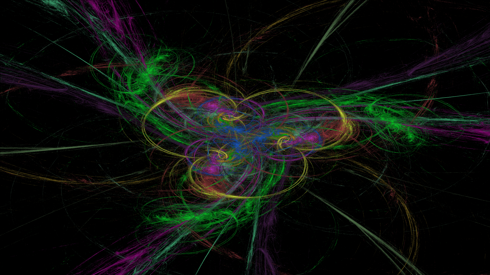

## Fractal flame generator

### Description

This program generates a fractal flame image. The algorithm described in the flame_draves.pdf is used.

## Starting the program

```rb
out/artifacts/essentials_jar/essentials.jar java -jar essentials.jar [path] [variations_type] [imege_format] [parameters]
```

* path - Path to the directory where the image is saved. All transformations from a file are supported. Required
  parameter.
* variations_type - Transformations. Optional parameters. Default - curl + exponential.
* image_format - PNG, JPEG, BMP. Default - PNG.
* parameters - For transformations with parameters. Each transformation depending on the parameters has default values.

You can change the generation parameters in the file

```rb
src/main/java/edu/FracalFlame/Constants.java
```

### Examples





